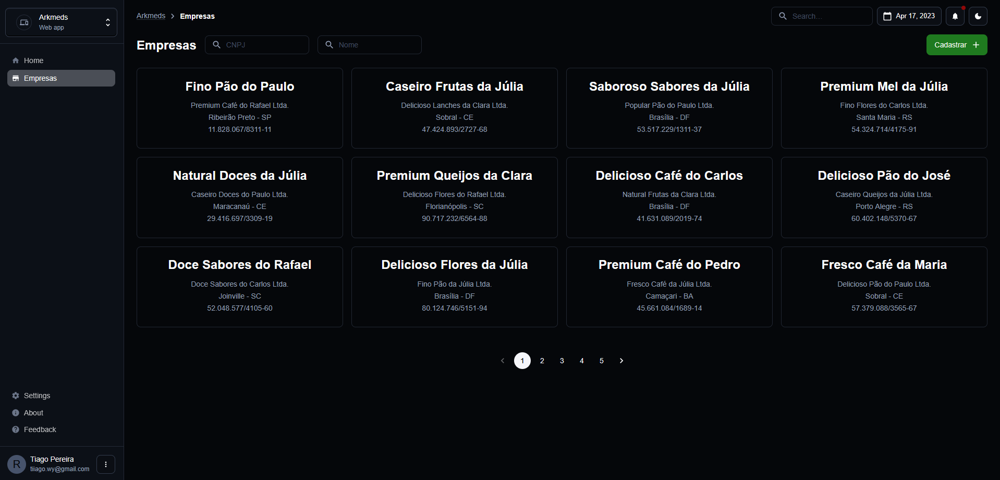
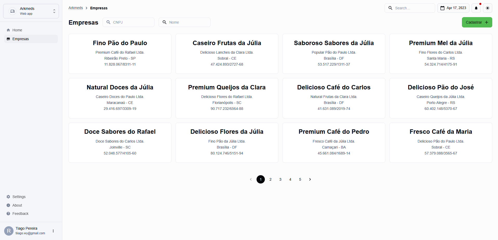
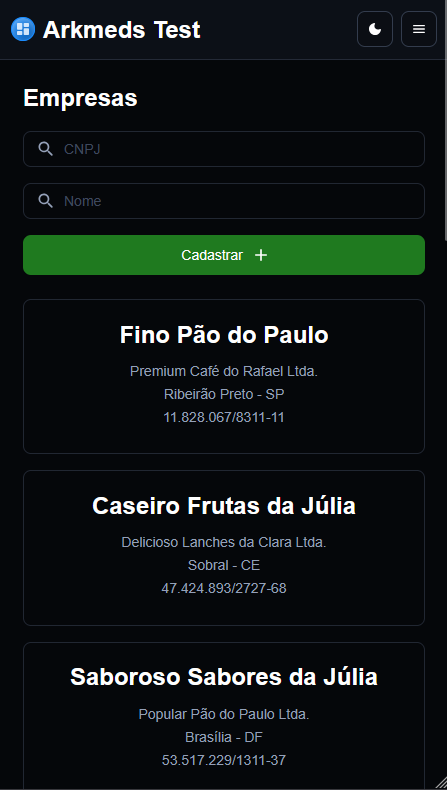
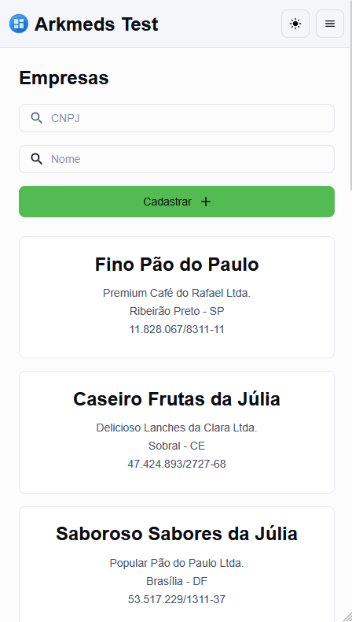
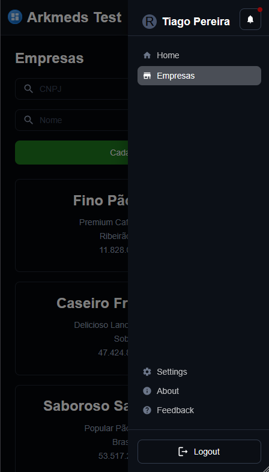
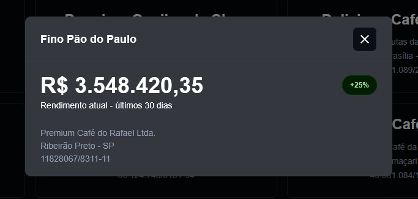
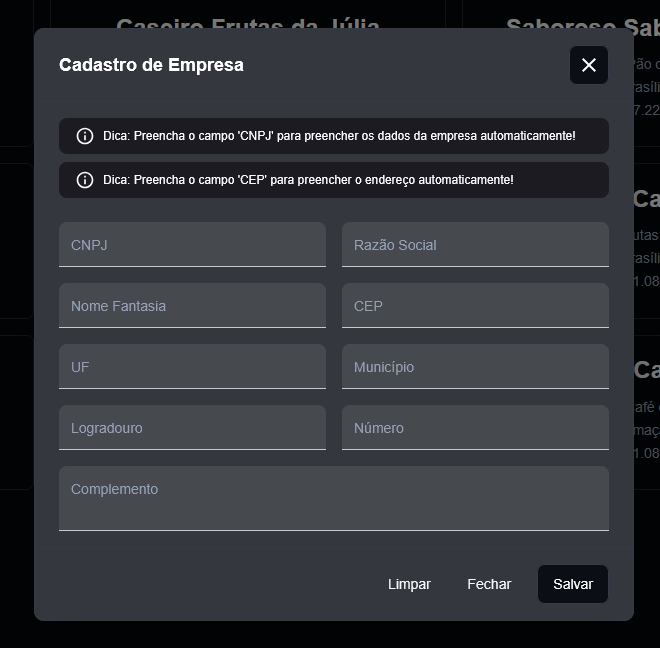
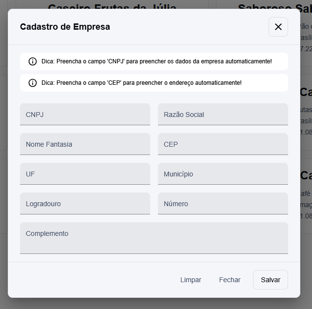

**ARKMeds – Frontend Test Challenge**

Bem-vindo(a) ao repositório `arkmeds`! Esta é uma mini aplicação SPA desenvolvida em Next.js que simula funcionalidades de um ERP simples: listagem e cadastro de empresas com integração às APIs de CNPJ e CEP, e testes ponta a ponta com Cypress.

---

## 🔖 Sumário

- [Sobre o Projeto](#-sobre-o-projeto)
- [Demo](#-demo)
- [Tecnologias](#-tecnologias)
- [Pré-requisitos](#-pré-requisitos)
- [Setup e Execução](#-setup-e-execução)
- [Variáveis de Ambiente](#-variáveis-de-ambiente)
- [Scripts Disponíveis](#-scripts-disponíveis)
- [Estrutura de Pastas](#-estrutura-de-pastas)
- [Funcionalidades](#-funcionalidades)
- [Integrações de API](#-integrações-de-api)
- [Testes End-to-End](#-testes-end-to-end)
- [Diferenciais](#-diferenciais)
- [Screenshots](#-screenshots)

---

## 📖 Sobre o Projeto

Desafio do processo seletivo para Desenvolvedor(a) Frontend Pleno na Arkmeds. O objetivo foi construir:

1. **Listagem de Empresas:** Exibe cards com detalhes básicos e modal para exibir o rendimento da empresa e mais detalhes.
2. **Cadastro de Empresas:** Formulário com validações e autocompletar de CNPJ e CEP.
3. **Testes E2E:** Cobertura dos principais fluxos com Cypress.

Utilização de Material UI, styled-components para garantir uma interface clara e responsiva.

## 🌟 Inspiração
- https://mui.com/material-ui/getting-started/templates/dashboard/

---

## 🚀 Demo

> Acesse a aplicação online: [arkmeds-test.vercel.app](https://arkmeds-test.vercel.app/)

---

## 🛠 Tecnologias

- **Next.js 15** (app router & turbopack)
- **React 19**
- **TypeScript 5**
- **Material UI**, **styled-components**, **@emotion**
- **React Query** para estado de dados
- **React Hook Form** + **Zod** para validações
- **Axios** para requisições HTTP
- **Day.js** para manipulação de datas
- **Cypress 14** para testes E2E
- **Tailwind CSS** para estilos rápidos

---

## ⚙️ Pré-requisitos

- Node.js >= 18
- Yarn ou npm

---

## ⚙️ Setup e Execução

1. Clone o repositório:
   ```bash
   git clone https://github.com/tii3030/arkmeds.git
   cd arkmeds
   ```
2. Instale as dependências:
   ```bash
   yarn install
   # ou
   npm install
   ```
3. Crie um arquivo `.env.local` e configure as variáveis de ambiente.
4. Rode em modo de desenvolvimento:
   ```bash
   yarn dev
   # ou
   npm run dev
   ```
5. Acesse em `http://localhost:3000`.

---

## 🔑 Variáveis de Ambiente (.env.local)

```bash
NEXT_PUBLIC_API_BASE_URL=
NEXT_PUBLIC_X_API_KEY=
NEXT_PUBLIC_JWT_TOKEN=
```

---

## 📜 Scripts Disponíveis

| Script       | Descrição                       |
| ------------ | ------------------------------- |
| `yarn dev`   | Inicia Next.js em modo dev      |
| `yarn build` | Gera build para produção        |
| `yarn start` | Inicializa servidor de produção |
| `yarn lint`  | Executa ESLint                  |

---

## 🗂 Estrutura de Pastas

```
arkmeds-test/
├── app/                 # Páginas e layout principal
│   ├── layout.tsx       # Layout global
│   ├── page.tsx         # Home (Implementação futura)
│   └── companies/       # Página (Listagem e cadastro)
├── components/          # Componentes de layout e theme
├── context/             # Contexts globais
├── hooks/               # Custom Hooks (CNPJ, CEP)
├── services/            # API clients e métodos
├── cypress/             # Testes E2E (listing, register)
├── public/              # Ativos estáticos
├── styles/              # Estilos globais
├── types/               # Tipagens 
└── utils/               # Métodos utilitátios, masks, constants...
```

---

## ✔️ Funcionalidades

- Listagem com paginação e filtro de empresas por nome (nome fantasia) ou CNPJ.
- Modal para exibir rendimento atual.
- Cadastro com validações e autocompletar de CNPJ e CEP.
- Feedback de erros e sucesso com toasts.

---

## 🔗 Integrações de API

- **Listagem:** `GET /companies`
- **Rendimento:** `GET /companies/:cnpj`
- **CNPJ:** `POST /companies/cnpj/CNPJ`
- **CEP:** `GET https://viacep.com.br/ws/{cep}/json`
- **Cadastro:** `POST /companies`

---

## 🧪 Testes End-to-End

- `company.cy.ts`: Testa listagem dos cards, filtros por nome fantasia e CNPJ, modal de detalhes da empresa (rendimento), modal de cadastro com os preenchimentos automaticos.

Execute com:

```bash
yarn cypress open
# ou
npm run cypress
```

---

## 🌟 Diferenciais

- Interface escalável com sideMenu, Header e seletor de tema (System, Light e Dark).
- Design responsivo e clean.
- Feedback de toast para sucesso e erros.
- Filtro e busca local para otimização.
- Integração de APIs para melhorar usabilidade.

---

## 📸 Screenshots










---

Feito com ❤️ por [Tiago](https://www.linkedin.com/in/tii3030),
obrigado por conferir o desafio! <3

